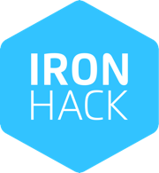

# Battleship Game

## Introduction

 This Game is my first project. I did it in week 3 at Ironhack. The game consists in a sea battle.

You have 90 seconds to shoot the submarines for points, but be aware of their torpedos ;).

## Setup

If you’d like to view my project in your browser:

https://pedrocncosta.github.io/Project_1_WWII/

open index.html

## Instructions

Use the left and right arrows to move and arrow down to shoot.

enjoy ;)

